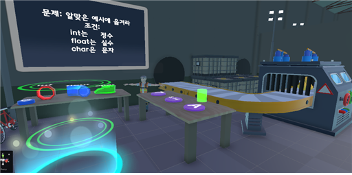
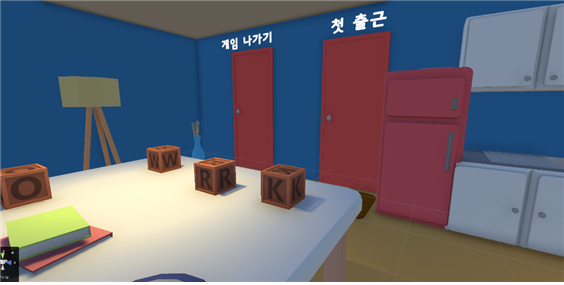
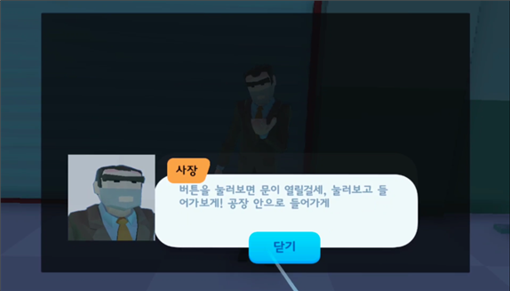
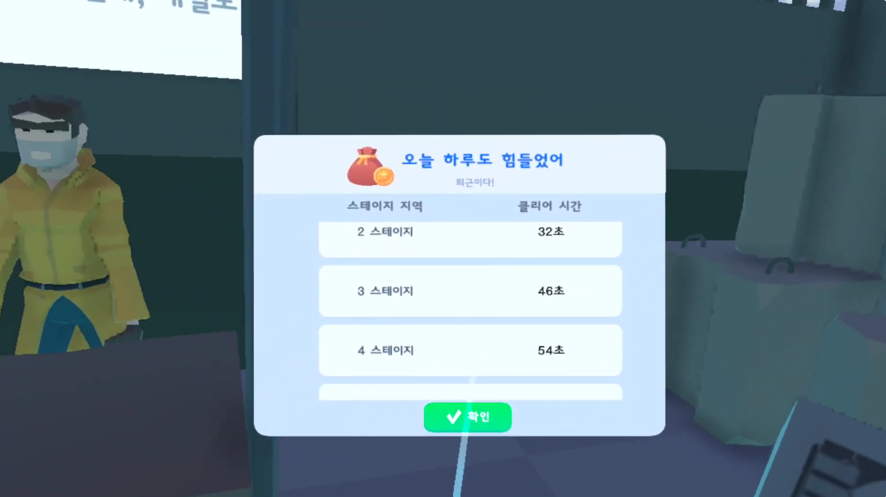

# CodeFactory

**VR 공간에서 C언어 퀴즈를 풀며 탈출하는 학습용 게임**
대학교 팀 프로젝트 (3명) / 2023년 9월 ~ 12월

  

↑ C언어 문제(변수·반복문·조건문·함수 등)를 풀며 진행

| 게임 시작 지점 | NPC와의 대화로 스토리 진행 |
|:---:|:---:|
|  |  |
| VR 공간을 걸어서 스테이지로 이동 | AI 음성 합성(CLOVA Voice)으로 NPC가 말함 |

   
  스테이지별 클리어 시간 표시

---

## 담당

전체 6개 스테이지 중 **2개 스테이지의 게임 로직**

## 주요 기능

- C언어 퀴즈 출제, 정답·오답에 따른 스토리 분기
- VR 컨트롤러 조작
- AI 음성 합성(Naver CLOVA Voice)을 이용한 NPC 대화
- 스테이지별 클리어 시간 표시

## 사용 기술

`Unity` `C#` `XR Interaction Toolkit` `Naver CLOVA Voice` `GitHub`

## 고민한 점

**3명이 같은 씬을 편집하면서 충돌이 자주 발생** → Unity 씬 파일은 하나의 파일에 많은 정보가 들어 있어서 머지할 때마다 충돌이 났습니다. 씬 안의 오브젝트를 Prefab(부품 파일)으로 나눠 저장·공유하는 규칙을 팀에서 정해 충돌을 크게 줄였습니다.
